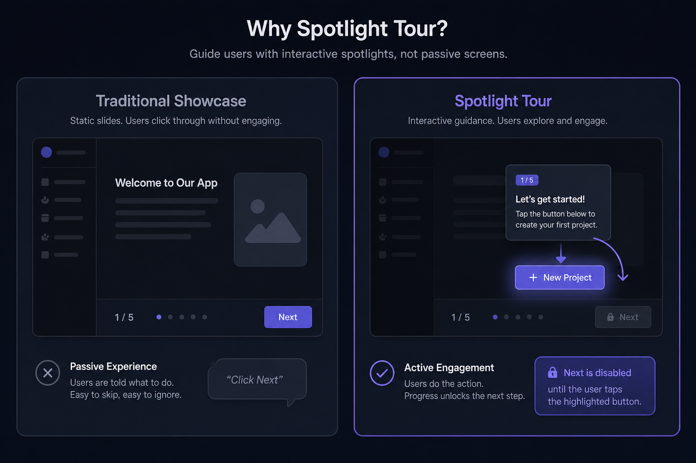
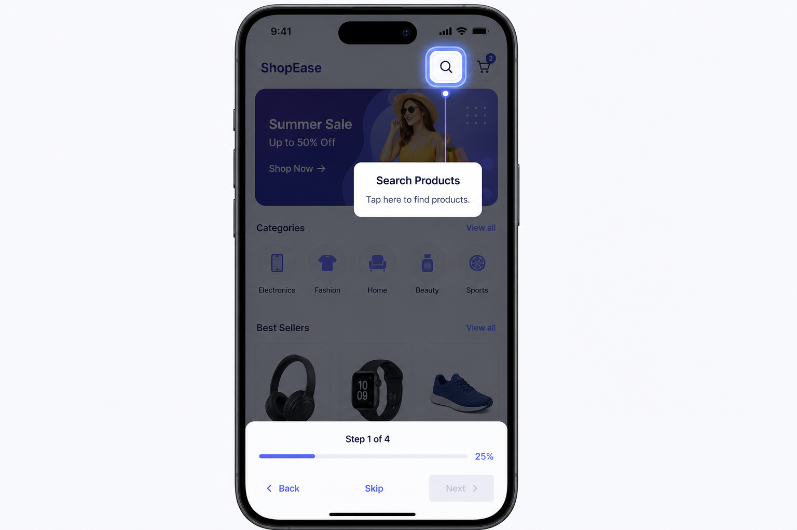
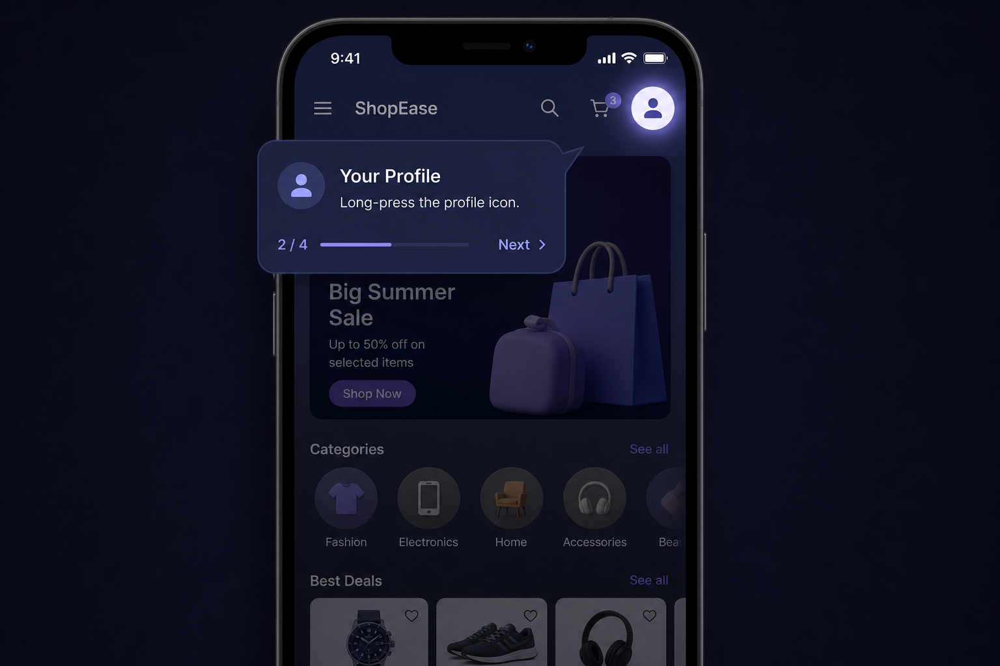
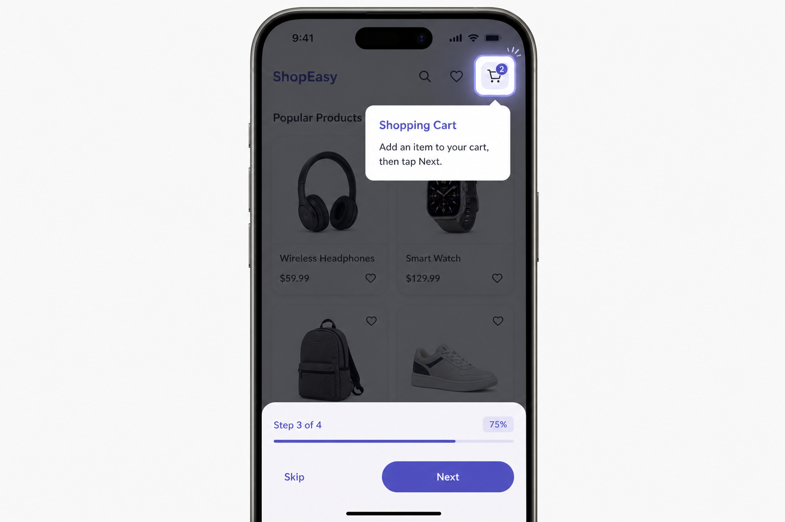

# Spotlight Tour

[](https://pub.dev/packages/spotlight_tour)
[](LICENSE)

**The first Flutter onboarding package with real interactive step validation.**

Traditional showcase packages only highlight widgets and let users click **Next**.  
Spotlight Tour verifies that users actually perform the required action before advancing — creating **real onboarding**, not slideshows.

<p align="center">
  
</p>

---

## Screenshots

<table>
  <tr>
    <td align="center">
      <br/>
      <b>Tap validation</b><br/>
      <sub>User must tap the search button</sub>
    </td>
    <td align="center">
      <br/>
      <b>Long-press validation</b><br/>
      <sub>User must long-press the profile icon</sub>
    </td>
    <td align="center">
      <br/>
      <b>Custom validator</b><br/>
      <sub>Next enabled after cart action</sub>
    </td>
  </tr>
</table>

---

## Why Spotlight Tour?

| Traditional Showcase | Spotlight Tour |
|---|---|
| Step 1 → Click Next | Step 1 → **Tap Search Button** |
| Step 2 → Click Next | Step 2 → **Long-press Profile** |
| Step 3 → Click Next | Step 3 → **Add to Cart, then Next** |
| Tutorial completed ✓ | Tutorial completed ✓ |

---

## Features

| Feature | Description |
|---|---|
| **Interactive validation** | Tap, double-tap, long-press, or custom async validators |
| **Premium spotlight** | Dimming, cutout, border glow, pulse animation |
| **Smart tooltips** | Title, description, custom widgets, auto-positioning |
| **Progress system** | Step counter + linear progress bar |
| **Navigation controls** | Next, Back, and Skip buttons |
| **Material 3 & Cupertino** | Native-feeling themes on every platform |
| **Multi-platform** | Android, iOS, and Web |

---

## Installation

Add to your `pubspec.yaml`:

```yaml
dependencies:
  spotlight_tour: ^1.0.0
```

Then run:

```bash
flutter pub get
```

---

## Quick Start

```dart
import 'package:flutter/material.dart';
import 'package:spotlight_tour/spotlight_tour.dart';

final GlobalKey searchKey = GlobalKey();

// 1. Attach the key to your target widget
IconButton(
  key: searchKey,
  icon: const Icon(Icons.search),
  onPressed: () => openSearch(),
)

// 2. Start the tour
SpotlightTour.start(
  context,
  steps: [
    TourStep(
      targetKey: searchKey,
      title: 'Search Products',
      description: 'Tap here to find products.',
      requiredAction: RequiredAction.tap,
    ),
  ],
);
```

---

## Interactive Validation

### Required gestures

```dart
TourStep(
  targetKey: searchKey,
  requiredAction: RequiredAction.tap,        // tap
  // requiredAction: RequiredAction.doubleTap, // double-tap
  // requiredAction: RequiredAction.longPress, // long-press
)
```

When a required action is set:

- The **Next** button stays disabled until the user performs the action
- The tour **auto-advances** once validation succeeds
- Touches pass through the spotlight hole to the real widget underneath

### Custom validators

```dart
bool userCompletedAction = false;

TourStep(
  targetKey: cartKey,
  title: 'Add to Cart',
  description: 'Add an item, then tap Next.',
  validator: () async => userCompletedAction,
)
```

Call `SpotlightTour.controller?.refreshValidation()` when external state changes.

---

## Spotlight Styling

```dart
TourStep(
  targetKey: myKey,
  spotlightStyle: SpotlightStyle(
    shape: SpotlightShape.roundedRectangle,
    blurStrength: 8,
    borderWidth: 3,
    showGlow: true,
    pulseAnimation: true,
    padding: 8,
    borderRadius: 12,
  ),
)
```

Supported shapes: `circle` · `rectangle` · `roundedRectangle`

---

## Tooltip Positioning

```dart
TourStep(
  targetKey: myKey,
  title: 'Hello',
  description: 'World',
  tooltipPosition: TooltipPosition.auto,
)
```

Auto mode detects available space, respects safe areas, and avoids keyboard overlap.

---

## Progress & Navigation

```dart
SpotlightTour.start(
  context,
  steps: steps,
  showProgress: true,
  showNextButton: true,
  showBackButton: true,
  showSkipButton: true,
  onComplete: () => print('Done!'),
  onSkip: () => print('Skipped'),
);
```

---

## Theming

```dart
// Material 3 (default on Android)
SpotlightTour.start(context, theme: SpotlightTourTheme.material3(), steps: steps);

// Cupertino (iOS-native feel)
SpotlightTour.start(context, theme: SpotlightTourTheme.cupertino(), steps: steps);

// Custom
SpotlightTour.start(
  context,
  theme: SpotlightTourTheme(
    primaryColor: Colors.blue,
    borderRadius: 24,
  ),
  steps: steps,
);
```

---

## Example App

```bash
git clone https://github.com/UmarAnayat/spotlight_tour.git
cd spotlight_tour/example
flutter run
```

The example demonstrates tap, long-press, double-tap validation, custom validators, spotlight effects, and auto tooltip positioning.

---

## Platform Support

| Platform | Status |
|---|---|
| Android | ✅ Supported |
| iOS | ✅ Supported |
| Web | ✅ Supported |
| Windows | 🔜 Architecture ready |
| macOS | 🔜 Architecture ready |
| Linux | 🔜 Architecture ready |

---

## Performance

Built for **60 FPS** with:

- `OverlayEntry` for efficient overlay rendering
- `RepaintBoundary` to isolate repaints
- `CustomPainter` for the spotlight effect
- Custom hit-testing so touches pass through the spotlight hole

---

## API Reference

### `SpotlightTour`

| Method / Property | Description |
|---|---|
| `SpotlightTour.start(context, steps: [...])` | Start a tour |
| `SpotlightTour.stop()` | Dismiss the active tour |
| `SpotlightTour.isActive` | Whether a tour is running |
| `SpotlightTour.controller` | Active controller for advanced use |

### `TourStep`

| Parameter | Type | Description |
|---|---|---|
| `targetKey` | `GlobalKey` | Widget to highlight **(required)** |
| `title` | `String?` | Tooltip title |
| `description` | `String?` | Tooltip description |
| `customTooltip` | `Widget?` | Custom tooltip widget |
| `requiredAction` | `RequiredAction?` | Required gesture |
| `validator` | `Future<bool> Function()?` | Custom validation |
| `spotlightStyle` | `SpotlightStyle?` | Per-step spotlight style |
| `tooltipPosition` | `TooltipPosition` | Tooltip placement |
| `onValidated` | `VoidCallback?` | Called on successful validation |

---

## Contributing

Issues and pull requests are welcome on [GitHub](https://github.com/UmarAnayat/spotlight_tour).

---

## License

MIT © [Umar Anayat](https://github.com/UmarAnayat) — see [LICENSE](LICENSE).
